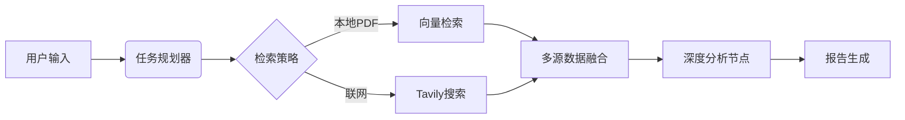

"# 📊 Market Research Agent

**基于 LLM 的全自动市场调研与研报生成系统**
支持 PDF 本地知识库与 Tavily 联网搜索的深度融合，实现从需求拆解、多源检索、数据分析到结构化研报生成的全链路自动化。


---

## ✨ 核心亮点 (Highlights)

-   **🧠 真正的 Agent 工作流**：不仅仅是调用 API，而是利用 **LangGraph** 构建了包含规划、执行、反思、修正的完整闭环状态机。
-   **⚡️ 实时流式响应 (SSE)**：后端采用 Server-Sent Events 技术，前端可实时看到 Agent 的思考过程（搜索了什么、分析了什么），拒绝黑盒等待。
-   **📚 RAG + Search 双引擎**：独创的多源检索策略，自动融合本地 PDF 私有数据与 Tavily 联网公开数据，并进行去重与冲突检测。
-   **🛡️ 事实一致性校验**：内置后置校验节点，自动核对生成报告中的数字与引用来源，大幅降低大模型幻觉。

---

## ✨ 功能特性

| 功能 | 说明 |
|------|------|
| 📄 **PDF 上传** | 支持上传 PDF 作为调研素材 |
| 🌐 **联网搜索** | 自动搜索权威信源（Tavily），支持自动/纯联网/禁用三种模式 |
| 🔍 **多源检索** | 融合 PDF 文档 + 网页搜索结果，自动去重与冲突检测 |
| 📝 **自动规划** | LLM 自动拆解调研任务为多个子方向 |
| 🧠 **流式分析** | 实时推送分析进度（SSE），前端可获取每一步状态 |
| ✍️ **智能写作** | 结构化生成研报（标题、摘要、行业现状、竞争格局、总结等） |
| ✅ **后置校验** | 自动检测报告中的数字/事实一致性，超阈值自动修正 |
| 📎 **信源溯源** | 报告关联引用元数据，支持追问 |
| 💬 **追问功能** | 基于已有素材与报告，回答后续问题 |
| 📑 **PDF 导出** | 一键下载带格式的 PDF 报告 |

## 🏗️ 项目结构


```
├── app.py                     # 主入口（FastAPI 应用）
├── agents/                    # 智能体模块
│   ├── providers/             #   LLM / 搜索 / Embedding 提供商
│   ├── retrieval/             #   检索与 PDF 生成
│   └── tools/                 #   工具函数（事实核查等）
├── business/                  # 业务逻辑（市场调研专用）
│   └── market_research/
│       ├── graph/             #   工作流定义（graph + streaming）
│       ├── nodes/             #   各阶段节点
│       ├── prompts/           #   提示词模板
│       ├── utils/             #   工具函数
│       └── api.py             #   市场调研 API 路由
├── core/                      # 核心引擎
│   ├── llm/                   #   LLM 封装（Ollama / DeepSeek / 通义千问）
│   ├── retrieval/             #   向量检索
│   ├── search/                #   搜索封装
│   ├── workflow/              #   通用工作流
│   └── config.py              #   全局配置
├── tools/                     # 通用工具
├── static/                    # 前端静态文件
├── templates/                 # 前端模板
├── scripts/                   # 辅助脚本
├── requirements.txt           # 依赖清单
└── .env.example               # 环境变量模板
```


## 🚀 快速开始

### 1. 环境准备

```bash
# 克隆项目
git clone https://github.com/your-username/market-research-agent.git
cd market-research-agent

# 创建虚拟环境
python -m venv venv
source venv/bin/activate  # Linux/Mac
# .\\venv\\Scripts\\activate  # Windows

# 安装依赖
pip install -r requirements.txt
```

### 2. 配置环境变量

```bash
cp .env.example .env
```

编辑 `.env`，至少配置以下一项：

```ini
# 方案 A：使用通义千问（推荐，免费额度高）
QWEN_API_KEY=your_dashscope_api_key

# 方案 B：使用本地 Ollama（免费）
OLLAMA_BASE_URL=http://localhost:11434
OLLAMA_MODEL=qwen2.5:7b

# 搜索引擎（可选，不配置则仅使用 PDF）
TAVILY_API_KEY=your_tavily_api_key
```

### 3. 启动服务

```bash
uvicorn app:app --host 0.0.0.0 --port 8000 --reload
```

打开浏览器访问 `http://localhost:8000`

## 📖 API 文档

| 接口 | 方法 | 说明 |
|------|------|------|
| `/api/v1/research` | POST | 非流式执行调研 |
| `/api/v1/research/stream` | POST | 流式执行调研（SSE） |
| `/api/v1/research/follow-up` | POST | 追问 |
| `/api/v1/session/{id}` | GET | 获取会话信息 |
| `/api/v1/report/{id}` | GET | 获取报告 |
| `/api/v1/conversation/{id}` | GET | 获取对话历史 |
| `/api/v1/ollama/models` | GET | 获取本地 Ollama 模型列表 |
| `/docs` | GET | Swagger 文档 |

## 🧪 技术栈

- **后端框架**: FastAPI + Uvicorn
- **AI 框架**: LangChain + LangGraph
- **大模型**: 通义千问 / DeepSeek / Ollama（本地）
- **向量数据库**: ChromaDB
- **搜索引擎**: Tavily
- **PDF 生成**: PyMuPDF
- **流式通信**: Server-Sent Events (SSE)


https://github.com/user-attachments/assets/0d6f7304-8d6e-4f95-bcd6-f53908813098


## 📝 许可证

[MIT](LICENSE)
"
